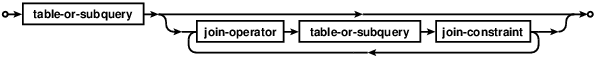

.. highlight:: rst
.. _SQLitesql:.. _SQLitesql:

.. _SQLitesql:

############################
SQLite SQL
############################
本章来源:
 
* SQLite: `SQLite SQL dialect <http://www.gdal.org/ogr_sql_sqlite.html>`_  
* SpatiaLite: `SpatiaLite 4.3.0 SQL functions reference list  <http://www.gaia-gis.it/gaia-sins/spatialite-sql-4.3.0.html>`_

********************
简介
********************

GDAL 1.10 版本后,可以使用 Sqlite 语法代替 ogrsql 语法.大部分语法支持都需要Spatialite库. 执行方式同样调用 GDALDataset::ExecuteSQL()  ,但是需要指定 pszDialect 参数为 "SQLITE".

********************
SELECT statement
********************

简单 select 语句如下:

.. image:: img/simple-select-stmt.png
   :alt: simple select statement
   :align: center

select 语法图如下:

 
 
join 语法如下:

********************
Spatialite SQL 
********************
可以参考网站 `SpatiaLite 4.3.0 SQL functions reference list  <http://www.gaia-gis.it/gaia-sins/spatialite-sql-4.3.0.html>`_ 上的说明,下面列出来几个常用的,需要GEOS库支持

SQL functions that implement spatial operators

+---------------+---------------------------------------------------------------+-------------+
| Function      |                       Syntax                                  |   Summary   |
+===============+===============================================================+=============+
| Intersection  || Intersection( geom1 Geometry , geom2 Geometry )              |   两物求交  |
|               || :Geometry                                                    |             |
|               +---------------------------------------------------------------+             |
|               || ST_Intersection( geom1 Geometry , geom2 Geometry )           |             |
|               || :Geometry                                                    |             |
+---------------+---------------------------------------------------------------+-------------+
| Difference    || Difference( geom1 Geometry , geom2 Geometry )                |   两物求差  |
|               || :Geometry                                                    |             |
|               +---------------------------------------------------------------+             |
|               || ST_Difference( geom1 Geometry , geom2 Geometry )             |             |
|               || :Geometry                                                    |             |
+---------------+---------------------------------------------------------------+-------------+
| GUnion        | GUnion( geom1 Geometry , geom2 Geometry ) : Geometry          |   两物求并  |
|               +---------------------------------------------------------------+             |
|               | ST_Union( geom1 Geometry , geom2 Geometry ) : Geometry        |             |
+---------------+---------------------------------------------------------------+-------------+
| GUnion        | GUnion( geom1 Geometry ) : Geometry                           |  整体求并   |
|               +---------------------------------------------------------------+             |
|               | ST_Union( geom1 Geometry ) : Geometry                         |             |
+---------------+---------------------------------------------------------------+-------------+
| Collect       | Collect( geom1 Geometry , geom2 Geometry ) : Geometry         |   合并两者  |
|               +---------------------------------------------------------------+             |
|               | ST_Collect( geom1 Geometry , geom2 Geometry ):Geometry        |             |
+---------------+---------------------------------------------------------------+-------------+
| Collect       |  Collect( geom Geometry ) : Geometry                          |  合并集合   |
|               +---------------------------------------------------------------+             |
|               |  ST_Collect( geom Geometry ) : Geometry                       |             |
+---------------+---------------------------------------------------------------+-------------+

+---------------+-------------------------------------------------------+-------------+
| Function      |                      Syntax                           |   Summary   |
+===============+=======================================================+=============+
| SymDifference || SymDifference( geom1 Geometry ,                      || 两物       |
|               || geom2 Geometry ):Geometry                            || 逻辑或     |
|               +-------------------------------------------------------+             |
|               || ST_SymDifference(geom1 Geometry                      |             |
|               || ,geom2 Geometry ):Geometry                           |             |
+---------------+-------------------------------------------------------+-------------+
| Buffer        | | Buffer( geom Geometry , dist Double precision[,     |    缓冲区   |
|               | | quadrantsegments int] ):Geometry                    |             |
|               +-------------------------------------------------------+             |
|               | | ST_Buffer( geom Geometry , dist Double precision[,  |             |
|               | | quadrantsegments int] ):Geometry                    |             |
+---------------+-------------------------------------------------------+-------------+
| | Hausdorff   || HausdorffDistance( geom1 Geometry , geom2 Geometry ) |豪斯多夫距离 |
| | Distance    || : Double precision                                   |             |
|               +-------------------------------------------------------+             |
|               || ST_HausdorffDistance( geom1 Geometry, geom2 Geometry)|             |
|               || :Double precision                                    |             |
+---------------+-------------------------------------------------------+-------------+
| OffestCurve   || OffsetCurve( geom Curve , radius                     | | 偏移曲线  |
|               ||  Double precision ) :Curve                           | | 正左负右  |
|               +-------------------------------------------------------+             |
|               || ST_OffsetCurve( geom Curve ,                         |             |
|               || radius Double precision): Curve                      |             |
+---------------+-------------------------------------------------------+-------------+
| Snap          || Snap( geom1 Geometry , geom2 Geometry , tolerance    |   咬合1到2  |
|               || Double precision ) : Geometry                        |             |
|               +-------------------------------------------------------+             |
|               || ST_Snap( geom1 Geometry , geom2 Geometry , tolerance |             |
|               || Double precision ) : Geometry                        |             |
+---------------+-------------------------------------------------------+-------------+

+---------------+-------------------------------------------------------+-------------+
| Function      |                      Syntax                           |   Summary   |
+===============+=======================================================+=============+
| | Dissolve    |  DissolveSegments( geom Geometry ) : Geometry         || 溶合线段   |
| | Segments    +-------------------------------------------------------+| 点不会动   |
|               |  ST_DissolveSegments( geom Geometry ) : Geometry      || 环被拆分   |
+---------------+-------------------------------------------------------+-------------+
|| Delaunay     || DelaunayTriangulation( geom Geometry [ , edges_only  | 德拉尼三角网|
|| Triangulation|| Boolean [ , tolerance Double precision ]]) : Geometry|             |
|               +-------------------------------------------------------+             |
|               || ST_DelaunayTriangulation( geom Geometry [, edges_only|             |
|               || Boolean [ , tolerance Double precision ] ]): Geometry|             |
+---------------+-------------------------------------------------------+-------------+
|VoronojDiagram || VoronojDiagram( geom Geometry [, edges_only Boolean [|  Voronoj图  |
|               || , frame_extra_size Double precision [ , tolerance    |             |
|               || Double precision ] ] ] ) : Geometry                  |             |
|               +-------------------------------------------------------+             |
|               || ST_VoronojDiagram( geom Geometry[, edges_only Boolean|             |
|               || [ , frame_extra_size Double precision [ , tolerance  |             |
|               || Double precision ] ] ] ) : Geometry                  |             |
+---------------+-------------------------------------------------------+-------------+
| ConvexHull    | ConvexHull( geom Geometry ) : Geometry                |    凸包     |
|               +-------------------------------------------------------+             |
|               | ST_ConvexHull( geom Geometry ) : Geometry             |             |
+---------------+-------------------------------------------------------+-------------+
|   ConcaveHull || ConcaveHull( geom Geometry [, factor Double precision|  凹包       |
|               || [ , allow_holes Boolean [, tolerance Double precision|             |
|               || ] ] ] ) : Geometry                                   |             |
|               +-------------------------------------------------------+             |
|               || ST_ConcaveHull( geom Geometry [ , factor Double      |             |
|               || precision [, allow_holes Boolean [ , tolerance Double|             |
|               || precision ] ] ] ) : Geometry                         |             |
+---------------+-------------------------------------------------------+-------------+
